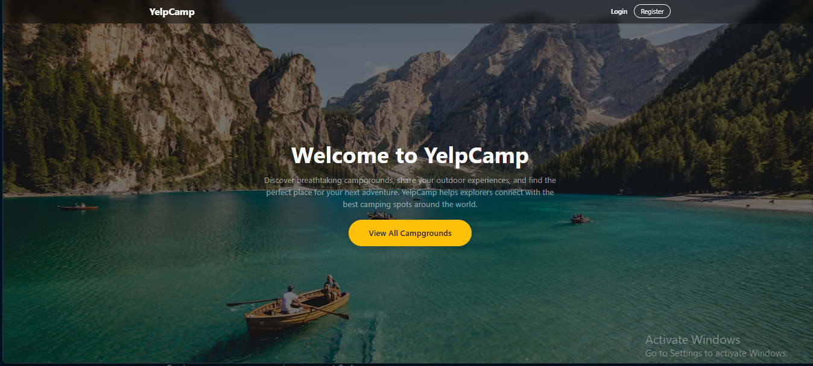
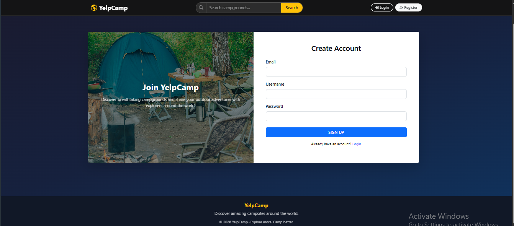
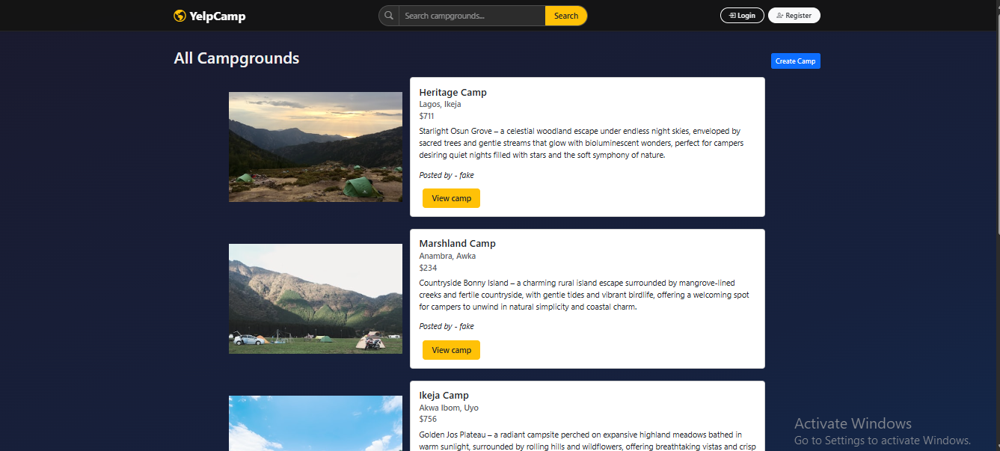
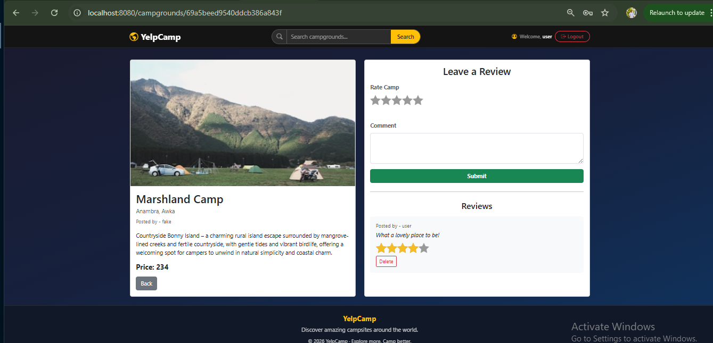
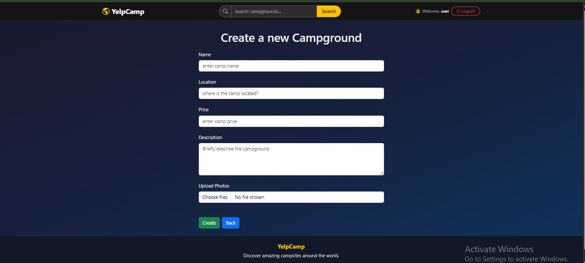

# YelpCamp

> **A full-stack marketplace for discovering, sharing, and reviewing camping sites**

### YelpCamp is a production-grade CRUD application that empowers outdoor enthusiasts to discover breathtaking campgrounds, share travel experiences, and organize adventures in one unified platform. Built with Node.js, Express, and MongoDB, it demonstrates enterprise patterns for authentication, file uploads, search functionality, and review systems.

## Table of Contents

- [YelpCamp](#yelpcamp)
    - [YelpCamp is a production-grade CRUD application that empowers outdoor enthusiasts to discover breathtaking campgrounds, share travel experiences, and organize adventures in one unified platform. Built with Node.js, Express, and MongoDB, it demonstrates enterprise patterns for authentication, file uploads, search functionality, and review systems.](#yelpcamp-is-a-production-grade-crud-application-that-empowers-outdoor-enthusiasts-to-discover-breathtaking-campgrounds-share-travel-experiences-and-organize-adventures-in-one-unified-platform-built-with-nodejs-express-and-mongodb-it-demonstrates-enterprise-patterns-for-authentication-file-uploads-search-functionality-and-review-systems)
  - [Table of Contents](#table-of-contents)
  - [Overview](#overview)
  - [Features](#features)
  - [Project UI](#project-ui)
  - [Tech Stack](#tech-stack)
  - [Architecture Overview](#architecture-overview)
  - [Getting Started](#getting-started)
    - [Prerequisites](#prerequisites)
    - [Installation](#installation)
    - [Environment Variables](#environment-variables)
    - [Running Locally](#running-locally)
    - [Seeding the Database](#seeding-the-database)
  - [Authentication \& Security](#authentication--security)
  - [External Services](#external-services)
    - [Cloudinary](#cloudinary)
    - [Unsplash API](#unsplash-api)
  - [Key Functionalities](#key-functionalities)
    - [Full-Text Search](#full-text-search)
    - [Cascading Deletes](#cascading-deletes)
    - [Post-Login Redirect](#post-login-redirect)
  - [Deployment](#deployment)
  - [Contributing](#contributing)
  - [Enjoy](#enjoy)

---

## Overview

YelpCamp solves the problem of fragmented campground discovery by providing a centralized platform where campers can:

- Browse and search campgrounds by name, location, or description
- Create and manage their own campground listings with image uploads
- Leave reviews and ratings on campgrounds they've visited
- Enjoy a secure, authenticated experience with role-based access control

This project was built as a comprehensive full-stack application demonstrating real-world patterns including RESTful routing, MVC architecture, session-based authentication, cloud media storage, and input validation.

---

## Features

- **User Authentication** — Register, log in, and log out securely using Passport.js with Local Strategy
- **Campground CRUD** — Create, read, update, and delete campground listings
- **Image Uploads** — Upload up to 5 images per campground via Cloudinary, with Unsplash API as a fallback
- **Review System** — Authenticated users can post and delete reviews with star ratings
- **Text Search** — Full-text MongoDB search across campground names, locations, and descriptions
- **Authorization** — Only campground/review authors can edit or delete their own content
- **Flash Notifications** — Real-time success and error feedback messages
- **Responsive UI** — Mobile-friendly design powered by Bootstrap 5
- **Input Validation** — Server-side validation using Joi schemas
- **Error Handling** — Centralized custom error handling with descriptive error pages

---

## Project UI








---

## Tech Stack

| Layer          | Technology                            |
| -------------- | ------------------------------------- |
| Runtime        | Node.js                               |
| Framework      | Express.js                            |
| Database       | MongoDB + Mongoose ODM + MongoAtlas   |
| Templating     | EJS + ejs-mate (layouts)              |
| Authentication | Passport.js + passport-local-mongoose |
| File Uploads   | Multer + Cloudinary                   |
| Image Fallback | Unsplash API                          |
| Validation     | Joi                                   |
| Sessions       | express-session + connect-flash       |
| Styling        | Bootstrap 5                           |
| HTTP Overrides | method-override                       |

---

## Architecture Overview

YelpCamp follows the **MVC (Model-View-Controller)** pattern with a clear separation of concerns:

Request → Router → Middleware (Auth, Validation, Upload) → Controller → Model → Database
↓
View (EJS Template)

**Routing** is handled by Express routers split by resource (`/campgrounds`, `/users`, `/campgrounds/:id/reviews`).

**Controllers** contain all business logic and are kept thin — they delegate data concerns to Mongoose models.

**Middleware** is composable and layered: authentication checks, author authorization, file upload handling, and Joi validation are all injected into routes as needed.

**Error Handling** uses a centralized `appError` class and a global Express error handler that renders a consistent error template.

---

## Getting Started

### Prerequisites

Ensure you have the following installed:

- [Node.js](https://nodejs.org/) v18+
- [MongoDB](https://www.mongodb.com/) (local instance or MongoDB Atlas)
- A [Cloudinary](https://cloudinary.com/) account
- An [Unsplash Developer](https://unsplash.com/developers) account (for the image fallback)

---

### Installation

```bash
# 1. Clone the repository
git clone https://github.com/TundeLawal1640/Yelp-camp.git

cd yelp-camp

# 2. Install dependencies
npm install
```

---

### Environment Variables

Create a `.env` file in the root of the project and add the following variables:

```env
# Cloudinary — for campground image uploads
CLOUDINARY_CLOUD_NAME=your_cloud_name
CLOUDINARY_API_KEY=your_api_key
CLOUDINARY_API_SECRET=your_api_secret

# Unsplash — fallback image API
UNSPLASH_ACCESS_KEY=your_unsplash_access_key

# Session secret (use a strong random string in production)
SESSION_SECRET=your_session_secret
```

> ⚠️ Never commit your `.env` file. Ensure it is listed in `.gitignore`.

---

### Running Locally

```bash
# Start the development server
node app.js

# Or with nodemon for auto-restart on file changes (recommended)
npx nodemon app.js
```

The app will be available at **http://not_ready_at_the_time_of_this_writeup**

---

### Seeding the Database

To populate your local MongoDB database with sample campgrounds:

```bash
node seeds/index.js
```

> ⚠️ This will **delete all existing campgrounds** before inserting seed data. Do not run in production.

You will need to update the `author` field in `seeds/index.js` with a valid MongoDB `ObjectId` from a registered user in your local database.

---

## Authentication & Security

YelpCamp implements a session-based authentication system with several layers of protection:

**Authentication** is handled by [Passport.js](http://www.passportjs.org/) using the `passport-local-mongoose` plugin, which automatically manages username/password hashing (salted + hashed via pbkdf2) without requiring manual bcrypt setup.

**Session Management** uses `express-session` with `httpOnly` cookies (preventing client-side JS access) and a 7-day expiry. In production, you should replace the in-memory session store with a persistent store such as `connect-mongo`.

**Authorization** is enforced at the route level via two middleware guards:

- `isAuthenticated` — redirects unauthenticated users to the login page and stores their intended URL for post-login redirect
- `isAuthor` — verifies the logged-in user is the owner of the campground or review before allowing edit/delete operations

**Input Validation** is performed server-side on all form submissions using Joi schemas, preventing malformed or malicious data from reaching the database.

---

## External Services

### Cloudinary

Used to store campground images in the cloud. Multer handles the multipart form data, and the `multer-storage-cloudinary` adapter streams files directly to Cloudinary.

To configure, sign up at [cloudinary.com](https://cloudinary.com) and add your credentials to `.env` as shown above.

### Unsplash API

Serves as an automatic image fallback when a user creates a campground without uploading any images. The app fetches a relevant outdoor/nature photo from the Unsplash API.

To configure, create a developer account at [unsplash.com/developers](https://unsplash.com/developers), create a new application, and copy your **Access Key** into `.env`.

---

## Key Functionalities

### Full-Text Search

Campground name, location, and description fields are indexed using MongoDB's text index. Users can search from the campgrounds listing page and results are ranked by relevance score:

```js
Campground.find(
  { $text: { $search: searchQuery } },
  { score: { $meta: "textScore" } },
).sort({ score: { $meta: "textScore" } });
```

### Cascading Deletes

When a campground is deleted, all associated reviews are automatically removed via a Mongoose `post('findOneAndDelete')` middleware hook on the `CampGroundSchema`, ensuring no orphaned documents remain in the database.

### Post-Login Redirect

If an unauthenticated user tries to access a protected route, their intended URL is saved in the session. After a successful login, they are redirected back to their original destination rather than a generic landing page.

---

## Deployment

Before deploying to production, make the following updates:

**1. Use MongoDB Atlas** instead of a local MongoDB instance. Replace the connection string in `app.js`:

```js
mongoose.connect(process.env.MONGO_URI);
```

**2. Add `MONGO_URI` to your environment variables:**

```env
MONGO_URI=mongodb+srv://<username>:<password>@cluster.mongodb.net/yelp-camp
```

**3. Replace the in-memory session store** with a persistent store to survive server restarts:

```bash
npm install connect-mongo
```

```js
import MongoStore from "connect-mongo";

const sessionConfig = {
  store: MongoStore.create({ mongoUrl: process.env.MONGO_URI }),
  secret: process.env.SESSION_SECRET,
  resave: false,
  saveUninitialized: false,
  cookie: { httpOnly: true, secure: true, maxAge: 1000 * 60 * 60 * 24 * 7 },
};
```

**4. Set `secure: true` on cookies** when serving over HTTPS.

**5. Recommended platforms:** [Render](https://render.com), [Railway](https://railway.app), [Fly.io], or [Heroku](https://heroku.com)

---

## Contributing

Contributions are welcome! To contribute:

1. Fork the repository
2. Create a feature branch: `git checkout -b feature/your-feature-name`
3. Commit your changes: `git commit -m 'Add some feature'`
4. Push to the branch: `git push origin feature/your-feature-name`
5. Open a Pull Request

Please ensure your code follows the existing project conventions and that all routes are protected appropriately.

---

## Enjoy

> Built with ❤️ by [Tunde Lawal](https://github.com/TundeLawal1640) — inspired by Colt Steele's Web Developer Bootcamp.
